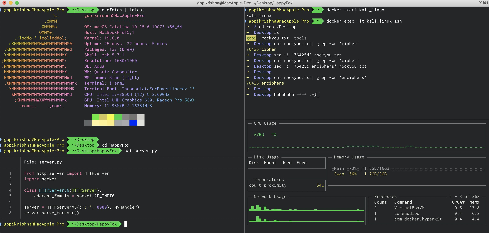

# Mac_Os Setup

This is my Macbook setup for Pentesting and Ethical Hacking, which makes my work a lot much easier. Hence thought of sharing it to the public. 

### Download and Install iTerm2 

`https://www.iterm2.com/downloads.html`

### Download and Install Docker Desktop for Mac

`https://hub.docker.com/editions/community/docker-ce-desktop-mac`

### Kali Linux Docker image

Pull my customised Kali linux image from my docker hub account

`https://hub.docker.com/r/z0x0z/kali_linux_z0x0z`

### Favourite Tools

Install my fav mac_os tools which comes handy in our day 2 day operations

`chmod 700 brew.sh`

`./brew.sh`

